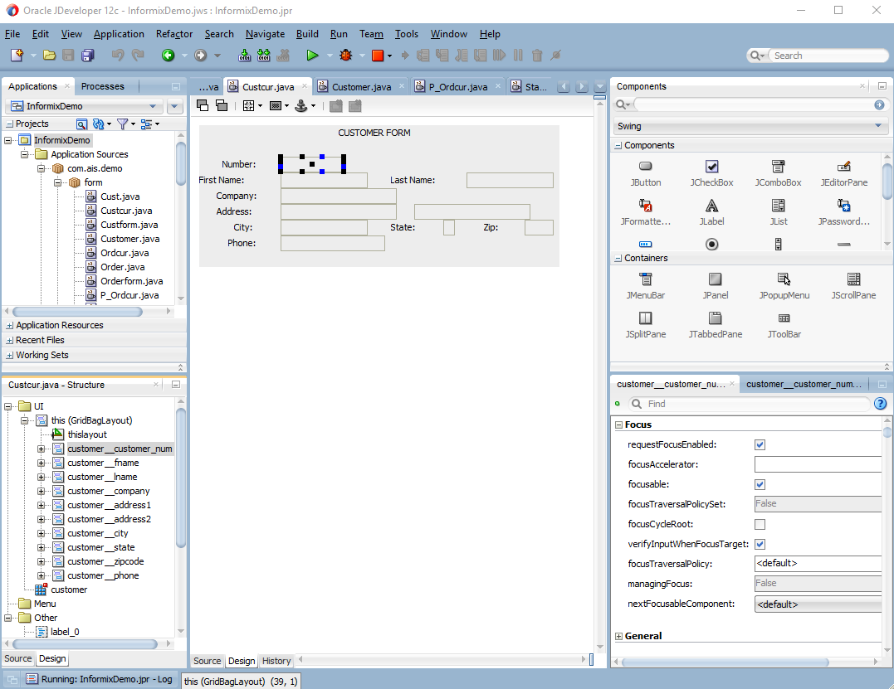

[](https://gitpod.io/#https://github.com/orellabac/Informix4GLToJavaDemo) 

Informix 4GL to Java Demo
=========================

This repository allows you to look at an example for migrating Informix 4GL apps
to java.

In this case the *stores* demo.

How to use this repository
==========================

You can start this repo directly in Gitpod to browse the 4GL source code and the target code.

Running the demo
================

First, in order to run the demo you need to setup an Informix 4GL database.
The easiest way is to just use docker.

```
docker run -it --name ifx --privileged -p 9088:9088 -p 9089:9089 -p 27017:27017 -p 27018:27018 -p 27883:27883 -e LICENSE=accept -e DB_INIT=1 ibmcom/informix-developer-database:latest
```
Starting the database usually takes about 5-10 minutes.

After starting the database you need to install the demo database.

To attach to the Informix Docker container (shell)

```
docker exec -it ifx bash
```

Once on the shell run:
```
cd /opt/ibm/informix/bin
./dbaccessdemo7 stores7
```

you can run the `dbaccess` tool to verify database installation.

Default user is:
user: informix
pass: in4mix

Once you have setup the application,
clone this repository
and run
./rundemo.sh or rundemo.bat

> NOTE: to start the database container
```
docker start ifx
```
or
```
docker stop ifx
```

Using an IDE
===========

You can use any Java IDE.

The following is an example using [JDeveloper](https://www.oracle.com/tools/downloads/Jdeveloper-12c-downloads.html)




Demo Video
==========

A small demo video can be seen here: 
[Demo Video](informix_demo.swf?raw=true)

